# Agentic RAG Pipeline Flow

```mermaid
flowchart TD
    A[User Question] --> B[AdvancedMultiAgentRAGSystem.answer_question]

    B --> C[QueryPlannerAgent]
    C -->|ENABLE_QUERY_DECOMPOSITION=true| C1[Generate 4 focused search queries]
    C -->|disabled| C2[Use original question as query]

    C1 --> D[HyDEAgent]
    C2 --> D

    D -->|ENABLE_HYDE=true| D1[Generate hypothetical evidence document]
    D -->|disabled| D2[Use question only]

    D1 --> E[Retrieval text = question + HyDE document]
    D2 --> E2[Retrieval text = question]

    E --> F[ResearcherAgent Iteration]
    E2 --> F

    F --> G[Tavily Web Search]
    G -->|MAX_SEARCH_RESULTS per query| H[Merge unique sources by URL]

    H --> I[Chunking]
    I --> I1[Split source content into chunks]
    I1 --> I2[Deduplicate chunks]

    I2 --> J{ENABLE_HYBRID_RETRIEVAL?}

    J -->|true| K[Hybrid Retrieval]
    K --> K1[Sparse BM25-style scoring]
    K --> K2[Dense embedding scoring]
    K1 --> K3[Combine hybrid scores]
    K2 --> K3
    K3 --> K4[Keep candidate pool]

    J -->|false| L[Simple lexical scoring]
    L --> L1[Token overlap with question]

    K4 --> M{ENABLE_CROSS_ENCODER_RERANKING?}
    L1 --> M

    M -->|true| N[CrossEncoderReranker]
    M -->|false| N2[Keep top rerank_top_k candidates]

    N --> O[Selected Evidence Chunks]
    N2 --> O

    O --> P[Merge evidence from all searches so far]

    P --> Q{ENABLE_EVIDENCE_FILTERING?}
    Q -->|true| R[EvidenceFilterAgent]
    R --> R1[Keep directly useful chunks]
    Q -->|false| R2[Keep top_k_chunks]

    R1 --> S{ENABLE_EVIDENCE_SUFFICIENCY?}
    R2 --> S

    S -->|false| W[AnswerWriterAgent]
    S -->|true| T[EvidenceSufficiencyAgent]

    T --> U{Evidence sufficient?}
    U -->|yes| W
    U -->|no| V{Retry count < MAX_EVIDENCE_RETRIES?}

    V -->|yes| V1[Generate follow-up queries]
    V1 --> F

    V -->|no| W
    U -->|no follow-up queries| W

    W --> X[Write grounded answer using evidence only]

    X --> Y[CriticAgent]
    Y --> Y1[Check groundedness]
    Y --> Y2[Check relevance]
    Y --> Y3[Decide needs_revision]

    Y3 --> Z{ENABLE_ITERATIVE_RETRIEVAL?}
    Z -->|false| AA[Final merge and final evidence filter]
    Z -->|true| AB{Critic needs revision?}

    AB -->|no| AA
    AB -->|yes| AC{Max iterations reached?}

    AC -->|yes| AA
    AC -->|no| AD[QueryPlannerAgent.next_iteration_queries]
    AD --> AD1[Generate follow-up queries from answer + critique]
    AD1 --> F

    AA --> AE{ENABLE_SELF_RAG?}
    AE -->|false| AF[FinalAnswer]
    AE -->|true| AG{Critic still needs revision?}

    AG -->|no| AF
    AG -->|yes| AH[AnswerWriter rewrites with critique]
    AH --> AI[Critic reviews rewritten answer]
    AI --> AF

    AF --> AJ[Return FinalAnswer object]
```



## Main Loops

```text
Pre-answer loop:
EvidenceFilter -> EvidenceSufficiencyAgent -> if missing evidence -> Researcher again

Post-answer loop:
AnswerWriter -> Critic -> if answer bad -> next_iteration_queries -> Researcher again

Self-RAG loop:
Final answer -> Critic -> rewrite with critique
```
